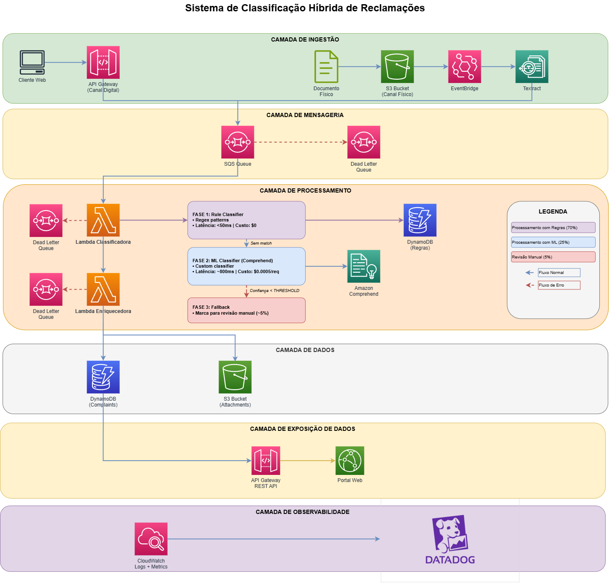

# 🏦 Case — Canais Críticos: Classificação Automática de Reclamações Bancárias

> **Solução completa** para ingestão, classificação e rastreabilidade de reclamações bancárias provenientes de canais digitais e físicos, com SLA de 10 dias corridos e volume de ~1.000 reclamações/dia.

---

## 📌 Índice

1. [O Problema](#o-problema)
2. [A Solução](#a-solução)
3. [Arquitetura Geral](#arquitetura-geral)
4. [Tópico 1 — Classificação Automática (código)](#tópico-1--classificação-automática-código)
5. [Tópico 2 — Fluxo, Observabilidade e Gargalos](#tópico-2--fluxo-observabilidade-e-gargalos)
6. [Tópico 3 — Arquitetura de Software](#tópico-3--arquitetura-de-software)
7. [Tópico 4 — Exemplo de Componente em Camadas](#tópico-4--exemplo-de-componente-em-camadas)
8. [Tópico 5 — Linguagens e Banco de Dados](#tópico-5--linguagens-e-banco-de-dados)
9. [Tópico 6 — Como a IA Acelera o Processo](#tópico-6--como-a-ia-acelera-o-processo)
10. [Estrutura do Repositório](#estrutura-do-repositório)

---

## O Problema

O banco recebe reclamações por dois canais distintos:

| Canal | Forma de entrada |
|---|---|
| **Digital** | Formulário no site (API REST) |
| **Físico** | Documento recepcionado e digitalizado (upload em S3 + OCR) |

Essas reclamações precisam ser:
- **Recepcionadas e padronizadas** independente do canal de origem
- **Classificadas automaticamente** por tipo de demanda (acesso, fraude, cobrança, etc.)
- **Rastreadas** durante todo o ciclo de vida com SLA de 10 dias
- **Expostas** em portal interno e enviadas para sistemas legados

**Escala:** ~1.000 novas reclamações/dia com picos e fluxo contínuo.

---

## A Solução

> Classificador híbrido serverless (regras + ML) sobre arquitetura event-driven na AWS, com observabilidade centralizada no Datadog e rastreabilidade completa no DynamoDB.

---

## Arquitetura Geral



### Fluxo resumido

```
[Canal Digital]  ──→  API Gateway
                              │
[Canal Físico]   ──→  S3 + Textract (OCR)
                              │
                         SQS (fila)
                              │
                         Lambda
                         ├── 1. Normaliza texto
                         ├── 2. Tenta classificar por REGRAS  ──→ match? → salva
                         ├── 3. Fallback: AWS Comprehend (ML) ──→ confiança ≥ threshold? → salva
                         └── 4. Baixa confiança → marca para REVISÃO HUMANA
                              │
                         DynamoDB  ←→  API interna / Portal / Sistemas legados
                              │
                         Datadog (logs + métricas + alertas)
```

---

## Tópico 1 — Classificação Automática (código)
<details>
<summary>Expandir/Recolher conteúdo do tópico</summary>

📄 [Ver documento completo](desenho-solucao/TOPICO_1_CLASSIFICACAO.md)


### Abordagem: Classificação por Palavras-Chave com Normalização

O classificador funciona em três passos:

**Passo 1 — Normalização**
Remove acentos, converte para minúsculas, normaliza espaços. Isso garante que `"Não"`, `"nao"` e `"NÃO"` sejam tratados de forma idêntica.

**Passo 2 — Busca com word boundaries**
Usa regex com `\b` para evitar falsos positivos. Ex: `"valor"` não ativa `"valorização"`.

**Passo 3 — Multi-label**
Retorna **todas** as categorias aplicáveis com detalhe de quais palavras fizeram match.

### Exemplo

**Entrada:**
```json
{
  "reclamacao": "Estou com problemas para acessar minha conta e o aplicativo está travando muito.",
  "categorias": {
    "acesso": ["acessar", "login", "senha"],
    "aplicativo": ["app", "aplicativo", "travando", "erro"],
    "fraude": ["fatura", "nao reconhece divida", "fraude"]
  }
}
```

**Saída:**
```json
{
  "categorias": ["acesso", "aplicativo"],
  "detalhes": {
    "acesso": ["acessar"],
    "aplicativo": ["aplicativo", "travando"]
  }
}
```

### Onde está o código

| Arquivo | Descrição |
|---|---|
| `implementacao/classificacao.py` | Função principal `classificar_reclamacao()` |
| `implementacao/test_classificacao.py` | Testes unitários com pytest |

</details>

---

## Tópico 2 — Fluxo, Observabilidade e Gargalos

<details>
<summary>Expandir/Recolher conteúdo do tópico</summary>

📄 [Ver documento completo](desenho-solucao/TOPICO_2_FLUXO.md)


### Observabilidade com Datadog

Cada reclamação gera logs estruturados com:
- ID, método de classificação, categorias encontradas, score de confiança, tempo total, erros

**Alarmes automáticos:**

| Alarme | Condição |
|---|---|
| Taxa alta de revisão manual | > 10% em 5 min |
| Erros em Lambda | > 5 erros/min |
| Dead Letter Queue com msgs | > 10 mensagens acumuladas |

### Como evitar gargalos

| Estratégia | Detalhe |
|---|---|
| **Lambda com concurrency reservada** | Isolamento de picos, custo previsível |
| **DynamoDB Auto-Scaling** | Mín. 5 / Máx. 100 unidades, sem ação manual |
| **Batch Processing no SQS** | Lotes de até 10 mensagens processadas em paralelo (threads) |
| **Cache de regras em memória** | Regras carregadas 1× por instância Lambda, evita consultas repetidas ao DynamoDB |

### Retry e DLQ

- Mensagens com falha: **3 retentativas** com backoff
- Após 3 falhas: vai para **Dead Letter Queue** para análise manual


</details>

---

## Tópico 3 — Arquitetura de Software

<details>
<summary>Expandir/Recolher conteúdo do tópico</summary>

📄 [Ver documento completo](desenho-solucao/TOPICO_3_ARQUITETURA.md)


### Clean Architecture + Event-Driven

A solução usa **Clean Architecture** com processamento orientado a eventos, organizada em camadas desacopladas:

```
┌─────────────────────────────────────────┐
│         CAMADA DE INGESTÃO              │
│  API Gateway (digital) + S3/Textract    │
│  (físico) → entrada padronizada         │
├─────────────────────────────────────────┤
│         CAMADA DE MENSAGERIA            │
│  SQS → absorve picos, garante           │
│  resiliência, habilita DLQ              │
├─────────────────────────────────────────┤
│       CAMADA DE PROCESSAMENTO           │
│  Rule Classifier → ML (Comprehend)      │
│  → Revisão Humana                       │
├─────────────────────────────────────────┤
│          CAMADA DE DADOS                │
│  DynamoDB (reclamações/estados)         │
│  S3 (documentos/anexos)                 │
├─────────────────────────────────────────┤
│       CAMADA DE EXPOSIÇÃO               │
│  API REST → Portal Interno              │
│  → Sistemas Legados                     │
├─────────────────────────────────────────┤
│       CAMADA DE OBSERVABILIDADE         │
│  CloudWatch + Datadog                   │
└─────────────────────────────────────────┘
```

### Por que Clean Architecture?

| Requisito do case | Como a arquitetura atende |
|---|---|
| Alto volume e picos | SQS desacopla ingestão e processamento |
| Múltiplos canais | Camada de ingestão unificada e normalizadora |
| Classificação evolutiva | Pipeline híbrido (regras → ML), começa simples e evolui |
| Rastreabilidade e SLA | Estados e timestamps persistidos no DynamoDB |
| Integração com legados | API REST desacoplada do core |

</details>

---

## Tópico 4 — Exemplo de Componente em Camadas

<details>
<summary>Expandir/Recolher conteúdo do tópico</summary>

📄 [Ver documento completo](desenho-solucao/TOPICO_4_COMPONENTES.md)

### O que esse componente faz

A Lambda **Classificadora** recebe uma reclamação, tenta classificar por regras e, quando necessário, usa IA como fallback.

### Separação por camadas (quem faz o quê)

| Camada | Responsabilidade | Exemplo |
|---|---|---|
| **Domain Layer** | Define os conceitos do negócio | Reclamação, Categoria, Resultado |
| **Use Case Layer** | Orquestra o fluxo de classificação | `ClassificarReclamacaoUseCase` |
| **Infrastructure Layer** | Implementa integrações técnicas | `RuleClassifier`, `MLClassifier`, `DynamoRepository` |
| **Presentation Layer** | Recebe o evento de entrada e devolve resposta | Lambda handler |


</details>

---

## Tópico 5 — Linguagens e Banco de Dados

<details>
<summary>Expandir/Recolher conteúdo do tópico</summary>

📄 [Ver documento completo](desenho-solucao/TOPICO_5_LINGUAGENS_DADOS.md)


### Linguagem: Python

- Ecossistema ML maduro (`boto3`, `comprehend`)
- Fácil manutenção e leitura
- Performance adequada para Lambdas de processamento

### Banco de Dados

**DynamoDB (principal)**
- Latência consistente < 10ms
- Auto-scaling nativo (sem servidor para gerenciar)
- Pay-per-request
- Integração nativa com Lambda

**DynamoDB separado para Regras**
- Atualização de regras de negócio **sem redeploy** da Lambda
- Auditoria e versionamento das regras
- Possibilita A/B testing de estratégias de classificação


</details>

---

## Tópico 6 — Como a IA Acelera o Processo

<details>
<summary>Expandir/Recolher conteúdo do tópico</summary>

📄 [Ver documento completo](desenho-solucao/TOPICO_6_IA.md)


### Onde a IA entra na solução

| Etapa | Serviço | Papel |
|---|---|---|
| OCR de documentos físicos | **AWS Textract** | Extrai texto de PDFs e imagens digitalizadas |
| Classificação ambígua | **AWS Comprehend** | Fallback quando regras não têm match suficiente |

### Melhorias futuras com IA

- **Fuzzy matching** — detectar variações de digitação ("travanndo", "aceso")
- **Embedding similarity** — classificar reclamações sem palavras-chave exatas
- **Fine-tuning** — treinar modelo próprio com histórico de reclamações classificadas manualmente
- **Análise de sentimento** — priorizar automaticamente reclamações com tom mais crítico

</details>

---